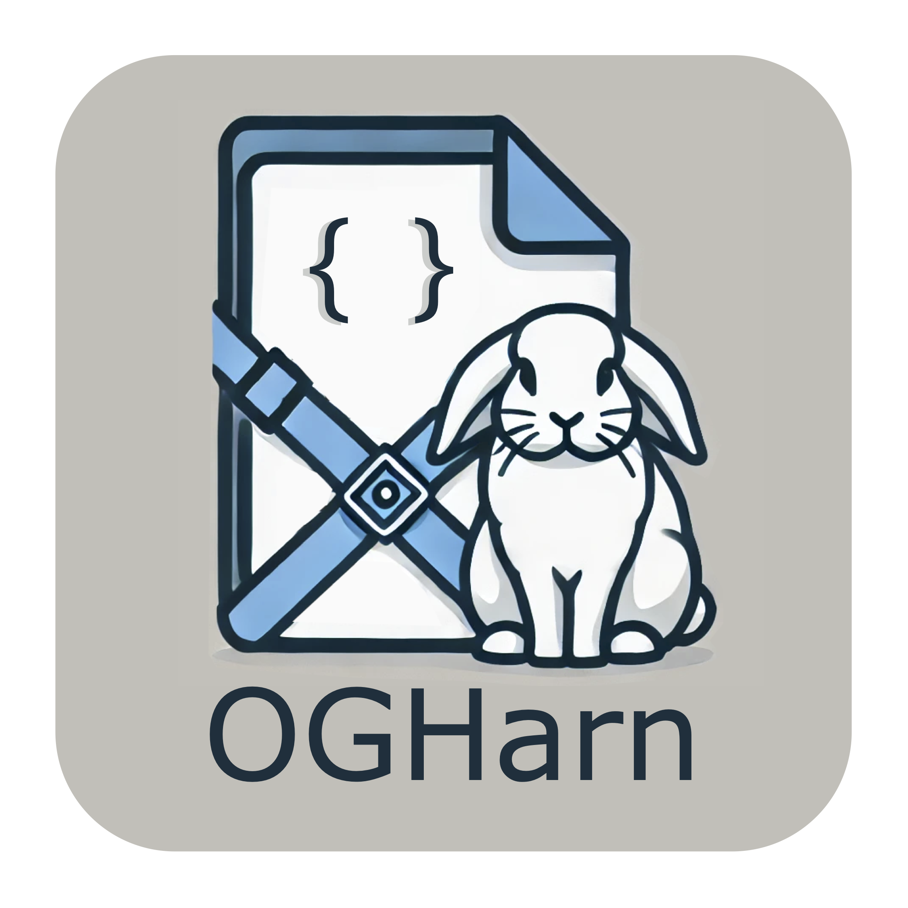
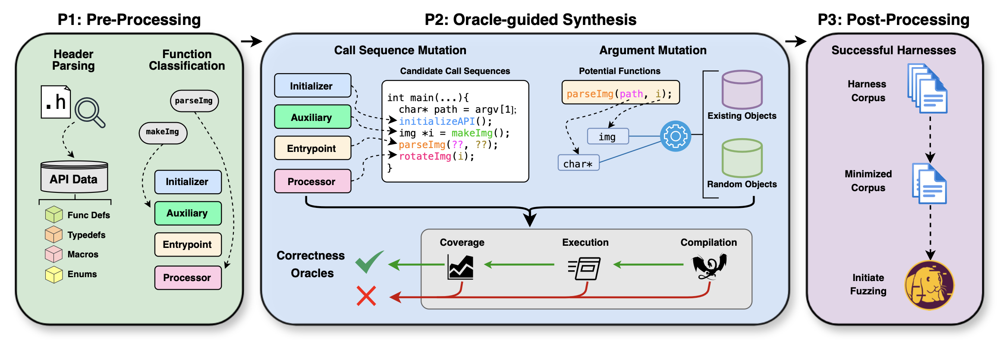

# OGHarn: Oracle-guided Fuzzing Harness Generation



This repository provides the source code for **OGHarn**: a prototype framework for automated generation of fuzzing harnesses for C library APIs. 

This work is presented in our paper **[No Harness, No Problem: Oracle-guided Harnessing for Auto-generating C API Fuzzing Harnesses](https://futures.cs.utah.edu/papers/25ICSE-b.pdf)**, appearing in the 2025 International Conference on Software Engineering (ICSE'25).

* [Installing OGHarn](#installation)
* [Target Library Setup](#target-library-setup)
* [Generating Harnesses](#generating-harnesses)
* [Additional Notes](#additional-notes)
* [Bug Trophy Case](#bug-trophy-case)

<br>

<table>
  <tr>
    <td><b>Citing this repository:</b></td>
    <td>
      <code class="rich-diff-level-one">@inproceedings{sherman:ogharn, title = {No Harness, No Problem: Oracle-guided Harnessing for Auto-generating C API Fuzzing Harnesses}, author = {Gabriel Sherman and Stefan Nagy}, booktitle = {{IEEE/ACM} {International} {Conference} on {Software Engineering} ({ICSE})}, year = {2025},}</code>
    </td>
  </tr>
  <tr>
    <td><b>Developers:</b></td>
    <td>Gabriel Sherman (<a href="mailto:gabe.sherman@utah.edu">gabe.sherman@utah.edu</a>) and Stefan Nagy (<a href="mailto:snagy@cs.utah.edu">snagy@cs.utah.edu</a>)</td>
  </tr>
  <tr>
    <td><b>License:</b></td>
    <td><a href="LICENSE">MIT License</a></td>
  </tr>
  <tr>
    <td><b>Disclaimer:</b></td>
    <td>This software is provided as-is with no warranty.</td>
  </tr>
</table>

Our original paper-version artifact is located at: https://zenodo.org/records/14727592.


# Installation
OGHarn relies on the following tools, which must both be installed to the `/extras` directory:
* [Multiplier](https://github.com/trailofbits/multiplier): a code indexer used in OGHarn's static analysis of the library under test.
* [AFL++](https://github.com/AFLPlusPlus): a grey-box fuzzer used in OGHarn's harness testing and code coverage analysis.

To install them, run either `/extras/install_dependencies.sh`, or use our available [Dockerfile](Dockerfile).

Once Multiplier and AFL++ are installed to `/extras`, run `/extras/set_env.sh` to:
- Activate Multiplier's Python virtual environment and allows access to its API.
- Add AFL++, Multiplier, and OGHarn to your system's `PATH`.
- Install OGHarn's other Python dependencies (`PyYAML`, `cfile v0.2.0`).


# Target Library Setup
The following details the necessary steps for configuring harness generation for new libraries. We recommend reviewing the [demos](demos) folder for more detailed examples.
### Step 1: Initial Setup
- `Library`: Harnesses generated by OGHarn are expected to be compiled with a dynamically-linked library instrumented with AFL++ and off-the-shelf sanitizers. Any of the Makefile targets titled `lib` in the demos folder provide examples for building a library for use by OGHarn.
- `Index`: OGHarn requires a `.db` file generated by Multiplier containing the index of the library. Any of the Makefile targets titled `run_mx` provide examples for indexing a library using Multiplier. Refer to the [Multiplier Docs](https://github.com/trailofbits/multiplier/blob/main/docs/INDEXING.md) for additional guidance.

### Step 2: Create Makefile and Define Key Flags
OGHarn relies on a user-supplied `Makefile` to define various flags and commands for compiling the harnesses targeting the library under test.
It must begin with the following:
- `CC_FUZZ` and `CXX_FUZZ`: AFL's compilers (`afl-clang-fast` and `afl-clang-fast++`, respectively).
- `CFLAGS_ASAN` and `CXXFLAGS_ASAN`: Compiler flags for ASAN and UBSan instrumentation.
- `DEPS`: Compile-time inclusion and linking commands for the eventual harnesses (e.g., `-I ... -L ...`).
- `DEPS_STC`: Compile-time library flags for _statically_-linked dependencies.
- `DEPS_DYN`: Compile-time library flags for _dynamically_-linked dependencies.
- `DEPS_LDD`: Path to the directory containing the target's compiled shared library.

As an example, below are associated `Makefile` definitions for [libMagic](https://github.com/file/file.git):
```
# Compilers and instrumentation (leave as-is).
CC_FUZZ         = afl-clang-fast    
CXX_FUZZ        = afl-clang-fast++
CFLAGS_ASAN     = -fsanitize=address,undefined
CXXFLAGS_ASAN 	= -fsanitize=address,undefined

# Library-specific settings (update accordingly).
DEPS            = -I library/src/ \
                  -L library/src/.libs
DEPS_STC        = -l:libmagic.a -llzma -lbz2 -lz -lzstd
DEPS_DYN        = -l magic
DEPS_LDD        = library/src/.libs/
```

### Step 3: Define Makefile Commands for Harness Analysis
- `harness`: Command to compile the harness using `CC_FUZZ` and `DEPS_DYN` (dynamic linking).
- `showmap`: Command to execute the harness using `afl-showmap`. Set `DEPS_LDD` accordingly.
  
If harnesses must be linked statically, the following commands also need to be supplied. Must be used in conjunction with OGHarn argument `--execute_both` (see [Optional Arguments and Experimental Modes](#optional-arguments-and-experimental-modes)).
- `harness_stc`: Same as above, but with `DEPS_STC` (static linking).
- `showmap_stc`: Same as above, but without setting `LD_LIBRARY_PATH`.

See the following example. Make sure that `$(OUT)` and `$(SEED)` are present as shown below, as these will be populated and used during OGHarn's harness generation.
```
harness: # Command for compiling individual harnesses.
  $(CC_FUZZ) -o $(OUT)/harness.out $(OUT)/harness.c $(DEPS) $(DEPS_DYN) $(CFLAGS_ASAN)

showmap: # Command for collecting harness code coverage.
  LD_LIBRARY_PATH=$(DEPS_LDD) afl-showmap -o $(OUT)/tempfile -- $(OUT)/harness.out $(SEED)
```
These targets will generally be the same across libraries unless the library under test requires extra environment configuration (e.g., setting the `MAGIC` environment variable during execution of harnesses for [magic](demos/magic/Makefile)).
### Step 4: Select Library Seed Inputs
OGHarn relies on two user-supplied seed file directories: 
- `seeds_valid`: Files that will be accepted by the target library (e.g., valid JSONs for [cJSON](https://github.com/FuturesLab/OGharn-Artifact-Final/tree/master/demos/cjson/seeds_valid)).
- `seeds_invalid`: Random, perturbed seeds that will be _rejected_ by the library.

OGHarn's seeds are no different than those used by fuzzers. For best results, we recommend using a varied corpus of valid and invalid seeds spanning a wide range of file sizes. Example seeds for various formats are available here: https://github.com/FuturesLab/fuzzing-seeds.

### Step 5: Optional Configuration
OGHarn allows for extra control over harnessing via a user-supplied `config.yaml`. Available settings include:
- `blacklist`: List of functions to _avoid_ during harnessing.
- `add_preamble`: Library function to be called _before fuzz data injection_ in any harness.
- `add_argument`: Hardcoded argument value for a particular function.
- `add_defines`: Any `#define` statements to include in each harness.

See [demos/sqlite](demos/sqlite/config.yaml), [demos/magic](demos/magic/config.yaml), and [demos/pcre2](demos/pcre2/config.yaml) for relevant examples.


### Step 6: Final Preparation
Before continuing, ensure that your `Makefile` as well as the `seeds_valid` and `seeds_invalid` directories are contained in the same folder, e.g.:
```
in_dir/
  /seeds_valid/
  /seeds_invalid/
  /Makefile
  /config.yaml (optional)
```
This directory (e.g., `in_dir` above) will serve as your input directory to OGHarn (passed via `--input`).  


# Generating Harnesses
To generate harnesses, run `ogharn.py` and update the following arguments accordingly. As an example, OGHarn's command for harnessing [cJSON](https://github.com/DaveGamble/cJSON.git) is:
```
ogharn.py -i in -o out -n 3 --m in/lib.db -h cJSON.h -r b
```
See the `run_ogharn.sh` scripts in each [demos](demos) sub-directory for more examples. 

### Required Arguments
- `--input`    (`-i`): Path to directory housing the user-provided `Makefile` and both `seeds_` dirs.
- `--output`   (`-o`): Path to the output directory where OGHarn's artifacts will be stored.
- `--numfuncs` (`-n`): Maximum functions to call per harness following "data entrypoint" routines.
- `--mxdb`     (`-m`): Path to Multiplier's generated `.db` database file.
- `--headers`  (`-h`): Library headers to target, to be injected via `#include` in each harness.
- `--readhow`  (`-r`): Controls how the harnesses will read fuzzer-generated data:
  - `buf`  (`b`): Via buffer (e.g., `foo(char* buffer)`).
  - `file` (`p`): Via file name/path (e.g., `bar(char* filename)`).

### Optional Arguments and Experimental Modes
- `--config` (`-c`): Path to optional `config.yaml` (see [Optional Configuration](#step-5-optional-configuration)).
- `--debug`  (`-d`): Report the following information from the harnessing campaign:
    - Failed harnesses and why they failed.
    - Successfully-generated harnesses.
    - Inferred function-to-function dependencies.
    - Multiplier-found declarations, typedef aliases, function pointers, enums, and macros.
    - Functions that were successfully harnessed.
    - Statistics about the harness generation campaign.
    - If applicable, values extracted from function call site parameter tracking.
- `--execute_both`    (`-e`): Run harnesses both dynamically/statically linked. Useful for linker-related crashes. 
- `--recurse_headers` (`-x`): Recursively parse all headers. Useful if definitions are spread across multiple files.
- `--fast_mode`       (`-f`): Work faster by disabling exhaustive arg search, keeping only the first-successful one.
- `--target_func`     (`-t`): Attempt harnessing to reach only the specified function. Useful for targeted fuzzing.
- `--allow_stderr`    (`-as`): Keeps harnesses where `stderr` output seen. Useful if `stderr` is valid API behavior.
- `--allow_lincov`    (`-al`): Keeps harnesses with linear codecov deltas. Useful for low input-dependent logic.
- `--allow_consts`    (`-ac`): Considers `const` args from one function as potential non-`const` args for others.
- `--allow_deepaux`   (`-ad`): Arg resolution via deeper auxiliary sequences. Adds significant cost to harnessing.
- `--allow_pvalret`   (`-ap`): Try to retrieve _concrete_ parameter values via Multiplier's callsite analysis.

# Additional Notes
Below details several enhancements and limitations to OGHarn. We refer readers to [our paper](https://futures.cs.utah.edu/papers/25ICSE-b.pdf) for full details.

### Newer Enhancements
The following enhancements were not present in our paper's version of OGHarn. 
- **Targeted Harnessing**: OGHarn previously only supported library-wide harnessing, but now supports function-specific harnessing (via `--target_func`). This helped us find bugs like https://github.com/pganalyze/libpg_query/issues/254, https://github.com/htacg/tidy-html5/issues/1120, and https://github.com/OpenPrinting/cups/issues/1026. This is still considered an experimental feature.
- **Struct Member Population**: OGHarn previously avoided structs entirely, but now attempts limited population of their members. This is still considered an experimental feature. We anticipate that OGHarn's current implementation is not well-suited to many struct-based libraries (e.g., libPNG, libVPX, etc.).
- **Deeper Argument Resolution Sequences**: OGHarn previously only resolved API-specific types (e.g., `cJSON *`) by injecting calls to single "auxiliary functions". By toggling-on `--allow_deepaux`, OGHarn will attempt multi-function _sequences_ for resolving such arguments. This is still considered an experimental feature.
- **Concrete Parameter Value Retrieval**: OGHarn previously operated only on targeted header files, but now optionally invokes Multiplier's aggressive _library-wide_ callsite analysis to learn and consider possible concrete values in its mutation of function parameters. This helped us find bugs some bugs like https://github.com/pantoniou/libfyaml/issues/121 and https://github.com/pantoniou/libfyaml/issues/122. Enable this mode via `--allow_pvalret`. 

### Debugging
If harnessing appears to be failing, we recommend using the `--debug` flag and inspecting OGHarn's reported information in the `output/debug` directory. Two important debugging artifacts are:
- `log_failed.txt`: Each failing harness and why it was discarded by OGHarn.
- `log_multiplier.txt`: Any available information about the library from Multiplier.

### Limitations
- **C Libraries**: OGHarn currently supports only C-based libraries.
- **Multiplier**: In cases where Multiplier fails, OGHarn will not work. We aren't sure of the extent of this.
- **Struct Population**: As described above, we are only at the beginning of testing out struct population. We leave refining this to future work. 
- **Server-Client APIs**: OGHarn does not support functions requiring complex _server-client_-style setup.


# Bug Trophy Case
We are pleased that OGHarn helped uncover the following software bugs and security vulnerabilities:

| API | Reported Bugs |
| ---- | ---- |
| HDF5 | https://github.com/HDFGroup/hdf5/issues/3790, https://github.com/HDFGroup/hdf5/issues/4431, https://github.com/HDFGroup/hdf5/issues/4432, https://github.com/HDFGroup/hdf5/issues/4433, https://github.com/HDFGroup/hdf5/issues/4434, https://github.com/HDFGroup/hdf5/issues/4435 |
| Lexbor | https://github.com/lexbor/lexbor/issues/220, https://github.com/lexbor/lexbor/issues/221, https://github.com/lexbor/lexbor/issues/222 |
| libFYAML | https://github.com/pantoniou/libfyaml/issues/107, https://github.com/pantoniou/libfyaml/issues/108, https://github.com/pantoniou/libfyaml/issues/118, https://github.com/pantoniou/libfyaml/issues/119, https://github.com/pantoniou/libfyaml/issues/120, https://github.com/pantoniou/libfyaml/issues/121, https://github.com/pantoniou/libfyaml/issues/122, https://github.com/pantoniou/libfyaml/issues/123 |
| libGEOS | https://github.com/libgeos/geos/issues/1021, https://github.com/libgeos/geos/issues/1070, https://github.com/libgeos/geos/issues/1071, https://github.com/libgeos/geos/issues/1072, https://github.com/libgeos/geos/issues/1073, https://github.com/libgeos/geos/issues/1074, https://github.com/libgeos/geos/issues/1084 | 
| libICAL | https://github.com/libical/libical/issues/677, https://github.com/libical/libical/issues/678 |
| libUCL | https://github.com/vstakhov/libucl/issues/288, https://github.com/vstakhov/libucl/issues/289, https://github.com/vstakhov/libucl/issues/290, https://github.com/vstakhov/libucl/issues/291, https://github.com/vstakhov/libucl/issues/292, https://github.com/vstakhov/libucl/issues/293 |
| StormLib | https://github.com/ladislav-zezula/StormLib/issues/327, https://github.com/ladislav-zezula/StormLib/issues/328, https://github.com/ladislav-zezula/StormLib/issues/329, https://github.com/ladislav-zezula/StormLib/issues/330, https://github.com/ladislav-zezula/StormLib/issues/331, https://github.com/ladislav-zezula/StormLib/issues/332, https://github.com/ladislav-zezula/StormLib/issues/333, https://github.com/ladislav-zezula/StormLib/issues/334, https://github.com/ladislav-zezula/StormLib/issues/335, https://github.com/ladislav-zezula/StormLib/issues/336, https://github.com/ladislav-zezula/StormLib/issues/337, https://github.com/ladislav-zezula/StormLib/issues/338 |
| RayLib | https://github.com/raysan5/raylib/issues/3924 |
| libPG_Query | https://github.com/pganalyze/libpg_query/issues/254 |
| Tidy-HTML5 | https://github.com/htacg/tidy-html5/issues/1120 |
| PCRE2 | https://github.com/PCRE2Project/pcre2/issues/561 |
| CUPS | https://github.com/OpenPrinting/cups/issues/1026 |

If you find any other bugs using OGHarn, please let us know!


# Acknowledgement

This material is based upon work supported by the National Science Foundation under Grant No. 2419798: [CICI: TCR: Practical, Systematic Fuzz Testing for Securing Scientific Software](https://www.nsf.gov/awardsearch/showAward?AWD_ID=2419798).
